# Reto de programación N1

**Curso:** Tópicos Especiales en Telemática <br>
**Título:** Comunicación entre Procesos Remotos: gRPC.

---

## Tabla de Contenido

1. [Introducción](#introduction)
2. [Problemas](#problemas)
3. [Recursos](#recursos)
4. [Desarrollo](#desarrollo) 
5. [Laboratorio 5](#lab5)
6. [Creación del cluster mediante AWS CLI](#cluster)
7. [Funcionalidad de la Main Node](#mainnode)
8. [Reto de programación 1](#reto1)
9. [Reto de programación 2](#reto2)
10. [Reto de programación 3](#reto3)
<br>

---

## 1. Introducción <introduction>

En este reto de laboratorio aprendí a crear clusters en AWS y los puse en práctica.

---

## 2. Problemas <problemas>

Tuve que cambiar un poco el código de 'wordcount-local.py' y documentarme bien acerca de los comandos para poder editarlos con los respectivos permisos.

---

## 3. Recursos <recursos>

Utilicé los conocimientos dados en el Laboratorio 5 y comandos tomados y adaptados de los siguientes recursos:

- [Repositorio del Laboratorio N6-MapReduce](https://github.com/ST0263/st0263-2023-1/tree/main/Laboratorio%20N6-MapReduce)
- [Guía de instalación de AWS CLI](https://docs.aws.amazon.com/cli/latest/userguide/getting-started-install.html)
- [Cómo crear y ejecutar un clúster EMR utilizando AWS CLI](https://towardsdatascience.com/how-to-create-and-run-an-emr-cluster-using-aws-cli-3a78977dc7f0#6df6)
- [Hadoop: Cómo listar archivos y directorios usando HDFS dfs](https://sparkbyexamples.com/apache-hadoop/hadoop-how-to-list-files-and-directories-using-hdfs-dfs/)
https://www.tablesgenerator.com/markdown_tables

---

## 4. Desarrollo <desarrollo>

Estos pasos solo los tuve que realizar una vez:  

### Creación del S3:  
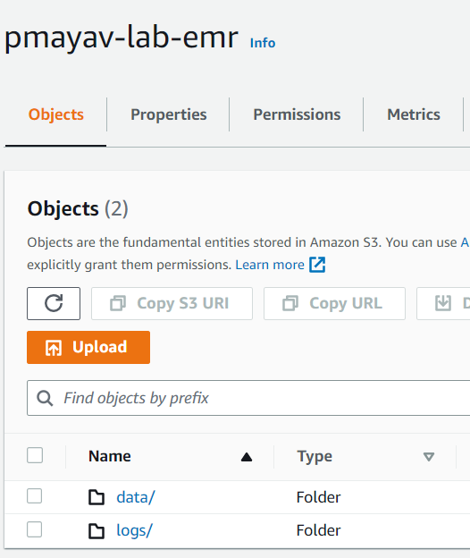

### Edición del security group de la Node Primaria/Master para que reciba SSH de todos lados:  
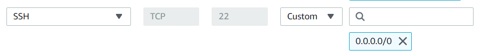

### Instalación de AWS CLI:
```sh
msiexec.exe /i https://awscli.amazonaws.com/AWSCLIV2.msi
```
Tomado de [Guía de instalación de AWS CLI](https://docs.aws.amazon.com/cli/latest/userguide/getting-started-install.html)
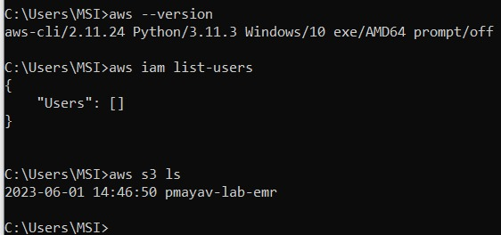

### Configuración de las credenciales de AWS CLI:  
Se necesita crear una carpeta en el directorio root del usuario llamada '.aws' y dentro de ella se crean 2 archivos sin extensión llamados 'credentials' y 'config':  

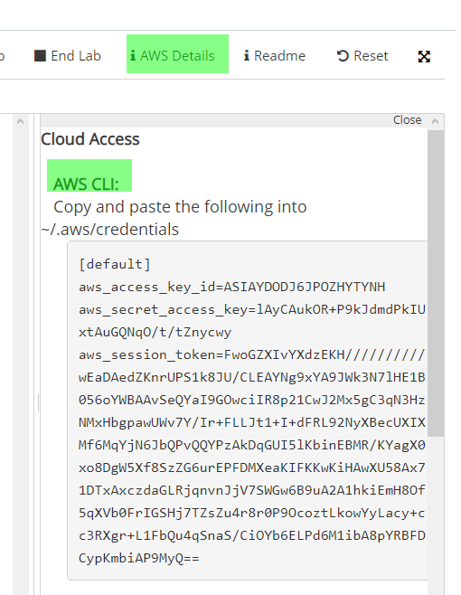

El contenido del archivo 'credentials' es el siguiente:
```plaintext
[default]
aws_access_key_id=
aws_secret_access_key=
aws_session_token=
```

---

## 5. Laboratorio 5 <lab5>

Crea el cluster usando la interfaz gráfica de AWS:  

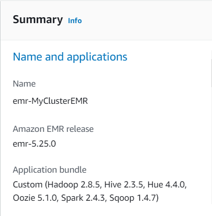
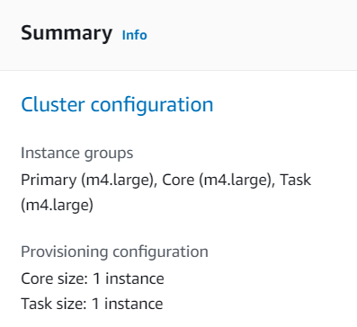
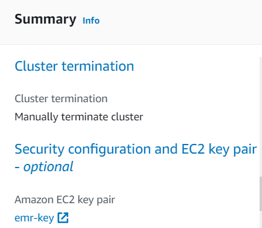


Instalación de requerimientos:
```sh
sudo yum install python3-pip &&
sudo pip3 install mrjob &&
sudo yum install git -y
```

Clonar el repositorio:
```sh
git clone https://github.com/p

mayavi/LabReto6_TET_PabloMayaV.git
cd LabReto6_TET_PabloMayaV/wordcount
```

Prueba del código:
```sh
python wordcount-mr.py /home/hadoop/LabReto6_TET_PabloMayaV/datasets/gutenberg-small/*.txt
```
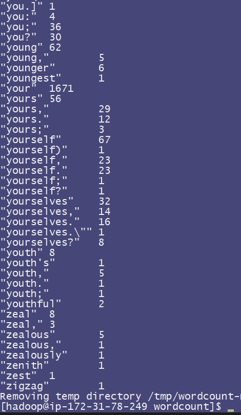

---

## 6. Creación del cluster mediante AWS CLI <cluster>

Se crea el cluster desde la consola con las especificaciones dadas usando AWS CLI:
```sh
aws emr create-cluster --release-label emr-6.10.0 --instance-type m4.large --instance-count 3 --log-uri s3://pmayav-lab-emr/logs --use-default-roles --ec2-attributes KeyName=emr-key,SubnetId=subnet-01fd4a313d0de3645 --no-termination-protected
```

Luego de que se cree correctamente el cluster, se toma el nombre DNS de la Node Primaria/Master:  

y se establece la conexión SSH:
```sh
ssh -i emr-key.pem hadoop@ec2-44-192-253-171.compute-1.amazonaws.com
```

---

## 7. Funcionalidad de la Main Node <mainnode>

Instalación de requerimientos:
```sh
sudo yum install python3-pip &&
sudo pip3 install mrjob &&
sudo yum install git -y
```

Clonar el repositorio:
```sh
git clone https://github.com/pmayavi/LabReto6_TET_PabloMayaV.git
cd LabReto6_TET_PabloMayaV/wordcount
```

Creación de usuario admin de Hadoop y copiar los datasets al usuario:
```sh
hdfs dfs -mkdir /user/admin/
hdfs dfs -copyFromLocal /home/hadoop/LabReto6_TET_PabloMayaV/datasets/ /user/admin/
```

Ejecutar el wordcount-mr.py en los datasets de Hadoop, el resultado se almacenará en la carpeta 'output1':
```sh
python wordcount-mr.py hdfs:///user/admin/datasets/gutenberg-small/*.txt -r hadoop --output-dir hdfs:///user/admin/output1
```

Para ver las partes del output, usar el comando:
```sh
hdfs dfs -ls -r /user/admin/output1/
```

Para ver el contenido de cada parte individualmente, usar el siguiente comando:
```sh
hdfs dfs -cat /user/admin/output1/part-00000
```
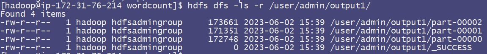

---

## 8. Reto de programación 1 <reto1>

Para recibir el output se necesita que la carpeta no exista, para testing y errores use este comando para borrar las carpetas del Hadoop:
```sh
hdfs dfs -rm -r /user/admin/output1-a/
```  

a) El salario promedio por Sector Económico (SE):
```sh
python Salario-Sector.py hdfs:///user/admin/datasets/otros/dataempleados.txt -r hadoop --output-dir hdfs:///user/admin/output1-a
```
| Sector economico | Salario promedio |
|------------------|------------------|
| 1212             | 77000.0          |
| 1234             | 37500.0          |
| 5434             | 36000.0          |
| 1412             | 76000.0          |
  
Para visualizar la data use estos comandos:
```sh
hdfs dfs -ls -r /user/admin/output1-a/
hdfs dfs -cat /user/admin/output1-a/part-00000 /user/admin/output1-a/part-00001 /user/admin/output1-a/part-00002
```
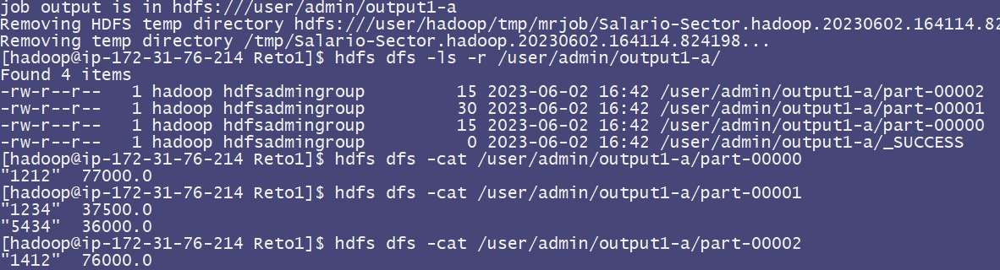  
  
b) El salario promedio por Empleado:
```sh
python Salario.py hdfs:///user/admin/datasets/otros/dataempleados.txt -r hadoop --output-dir hdfs:///user/admin/output1-b
```
| ID del empleado | Salario promedio |
|-----------------|------------------|
| 3237            | 40000.0          |
| 1115            | 76500.0          |
| 3233            | 35500.0          |
  
Para visualizar la data use estos comandos:
```sh
hdfs dfs -ls -r /user/admin/output1-b/
hdfs dfs -cat /user/admin/output1-b/part-00000 /user/admin/output1-b/part-00001 /user/admin/output1-b/part-00002
```
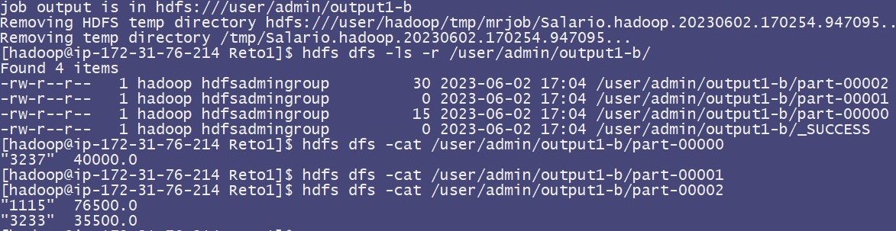  
  
c) Número de SE por Empleado que ha tenido a lo largo de la estadística:
```sh
python Sector-Empleado.py hdfs:///user/admin/datasets/otros/dataempleados.txt -r hadoop --output-dir hdfs:///user/admin/output1-c
```
| ID del empleado | Numero de SE |
|-----------------|--------------|
| 3237            | 1            |
| 1115            | 2            |
| 3233            | 2            |
  
Para visualizar la data use estos comandos:
```sh
hdfs dfs -ls -r /user/admin/output1-c/
hdfs dfs -cat /user/admin/output1-c/part-00000 /user/admin/output1-c/part-00001 /user/admin/output1-c/part-00002
```
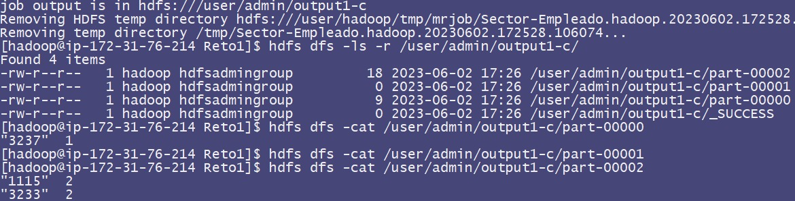  

---

## 9. Reto de programación 2 <reto2>

a) Por acción, dia-menor-valor, día-mayor-valor:
```sh
python Min-Max.py hdfs:///user/admin/datasets/otros/dataempresas.txt -r hadoop --output-dir hdfs:///user/admin/output2-a
```
| Empresa | Menor      | Mayor      |
|---------|------------|------------|
| EPM     | 2015-01-02 | 2015-01-01 |
| Exito   | 2015-01-01 | 2015-01-02 |
  
Para visualizar la data use estos comandos:
```sh
hdfs dfs -ls -r /user/admin/output2-a/
hdfs dfs -cat /user/admin/output2-a/part-00000 /user/admin/output2-a/part-00001 /user/admin/output2-a/part-00002
```
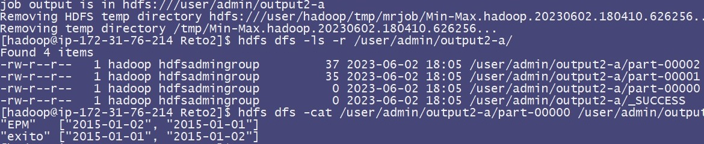  


b) Listado de acciones que siempre han subido o se mantienen estables:
```sh
python Acciones-Estables.py hdfs:///user/admin/datasets/otros/dataempresas.txt -r hadoop --output-dir hdfs:///user/admin/output2-b
```
| Empresa | Comportamiento de acciones |
|---------|----------------------------|
| EPM     | Baja o no es estable       |
| Exito   | Sube o se mantiene estable |
  
Para visualizar la data use estos comandos:
```sh
hdfs dfs -ls -r /user/admin/output2-b/
hdfs dfs -cat /user/admin/output2-b/part-00000 /user/admin/output2-b/part-00001 /user/admin/output2-b/part-00002
```
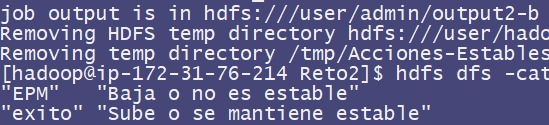  


c) DIA NEGRO: la mayor cantidad de acciones tienen el menor valor de acción (DESPLOME):
```sh
python Dia-Negro.py hdfs:///user/admin/datasets/otros/dataempresas.txt -r hadoop --output-dir hdfs:///user/admin/output2-c
```
Dia Negro: 2015-01-02
  
Para visualizar la data use estos comandos:
```sh
hdfs dfs -ls -r /user/admin/output2-c/
hdfs dfs -cat /user/admin/output2-c/part-00000 /user/admin/output2-c/part-00001 /user/admin/output2-c/part-00002
```
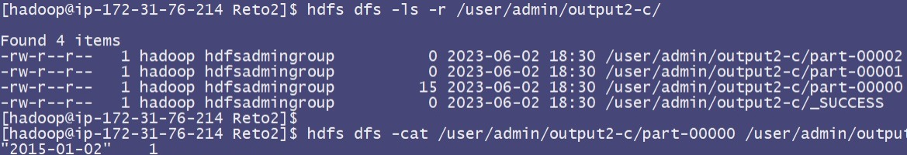  

---

## 10. Reto de programación 3 <reto3>

a) Número de películas vista por un usuario y su valor promedio de calificación:
```sh
python PeliculasUsuarioCalificacion.py hdfs:///user/admin/datasets/otros/datapeliculas.txt -r hadoop --output-dir hdfs:///user/admin/output3-a
```
| ID usuario | Rating promedio | Peliculas calificadas |
|--------|---------|--------|
| 222    |   5.0   |   1    |
| 234    |   5.0   |   1    |
| 246    |   3.0   |   1    |
| 327    |   5.0   |   1    |
| 387    |   5.0   |   1    |
| 465    |   5.0   |   1    |
| 474    |   4.0   |   1    |
| 486    |   4.0   |   1    |
| 51     |   2.0   |   1    |
| 546    |   2.0   |   1    |
| 603    |   5.0   |   1    |
| 768    |   2.0   |   1    |
| 1      |   4.0   |   1    |
| 1042   |   4.0   |   1    |
| 1081   |   1.0   |   1    |
| 118    |   2.0   |   1    |
| 16     |   4.0   |   1    |
| 193    |   4.0   |   1    |
| 265    |   2.0   |   1    |
| 274    |   3.0   |   2    |
| 277    |   4.0   |   1    |
| 304    |    3.8  |   5    |
| 346    |   1.0   |   1    |
| 40     |   3.0   |   1    |
| 451    |   3.0   |   1    |
| 796    |   1.0   |   1    |
| 88     |   4.0   |   1    |
| 979    |   2.0   |   1    |
| 1184   |   2.0   |   1    |
| 194    |   3.0   |   1    |
| 257    |   2.0   |   1    |
| 29     |   3.0   |   1    |
| 302    |   3.0   |   1    |
| 32     |   4.0   |   1    |
| 377    |   1.0   |   1    |
| 392    |   4.0   |   1    |
| 785    |   3.0   |   1    |
| 86     |   3.0   |   1    |
| 95     |   5.0   |   1    |
| 98     |   4.0   |   1    |
  
Para visualizar la data use estos comandos:
```sh
hdfs dfs -ls -r /user/admin/output3-a/
hdfs dfs -cat /user/admin/output3-a/part-00000 /user/admin/output3-a/part-00001 /user/admin/output3-a/part-00002
```
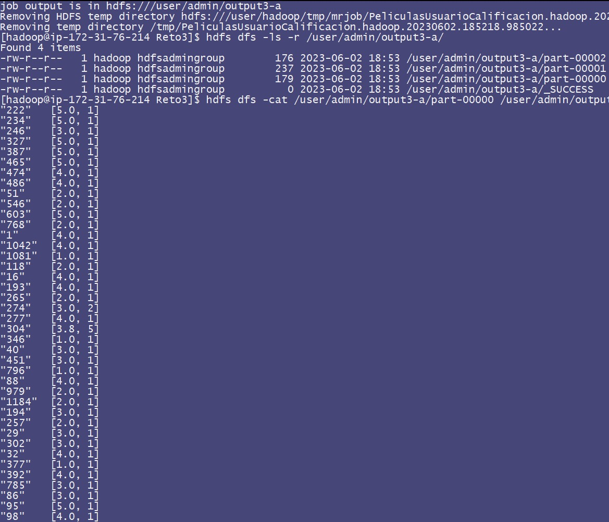  

b) Día en que más películas se han visto:
```sh
python MaxPeliculas.py hdfs:///user/admin/datasets/otros/datapeliculas.txt -r hadoop --output-dir hdfs:///user/admin/output3-b
```
Dia mas visto:      2014-03-20  
Peliculas vistas:   11
  
Para visualizar la data use estos comandos:
```sh
hdfs dfs -ls -r /user/admin/output3-b/
hdfs dfs -cat /user/admin/output3-b/part-00000 /user/admin/output3-b/part-00001 /user/admin/output3-b/part-00002
```
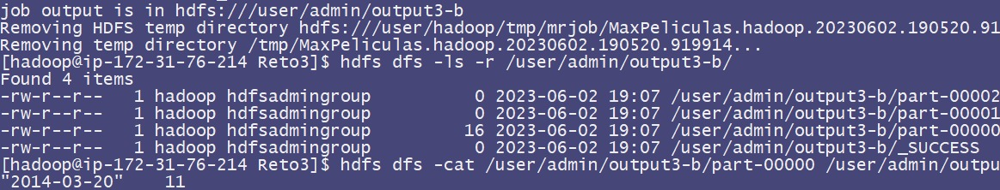  

c) Día en que menos películas se han visto:
```sh
python MinPeliculas.py hdfs:///user/admin/datasets/otros/datapeliculas.txt -r hadoop --output-dir hdfs:///user/admin/output3-c
```
Dia menos visto:    2014-03-23
Peliculas vistas:   5
  
Para visualizar la data use estos comandos:
```sh
hdfs dfs -ls -r /user/admin/output3-c/
hdfs dfs -cat /user/admin/output3-c/part-00000 /user/admin/output3-c/part-00001 /user/admin/output3-c/part-00002
```
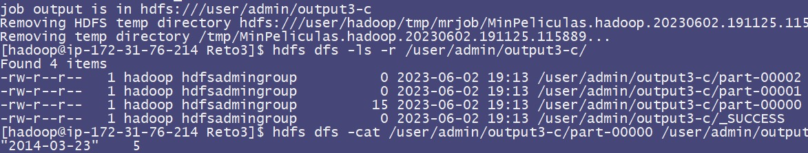  

d) Número de usuarios que ven una misma película y el rating promedio:
```sh
python CalificacionPeliculas.py hdfs:///user/admin/datasets/otros/datapeliculas.txt -r hadoop --output-dir hdfs:///user/admin/output3-d
```
|  ID Pelicula |  Rating promedio |  Usuarios que la vieron |
|--------|---------|--------|
| 102    |   2.0   |   1    |
| 186    |   3.0   |   1    |
| 201    |   2.0   |   1    |
| 210    |   3.0   |   1    |
| 225    |   4.0   |   1    |
| 234    |   2.0   |   1    |
| 276    |   2.0   |   2    |
| 291    |   3.0   |   2    |
| 303    |   3.0   |   1    |
| 6      |   3.0   |   1    |
| 10     |   4.0   |   1    |
| 115    |   2.0   |   1    |
| 160    |   5.0   |   1    |
| 166    |   1.0   |   1    |
| 181    |   1.0   |   1    |
| 196    |   3.5   |   2    |
| 22     |   1.0   |   1    |
| 244    |   3.25  |   4    |
| 253    |   5.0   |   1    |
| 286    |   5.0   |   1    |
| 298    |   4.0   |   1    |
| 301    |   4.0   |   1    |
| 7      |   4.0   |   1    |
| 97     |   3.0   |   1    |
| 119    |   4.0   |   1    |
| 122    |   5.0   |   1    |
| 167    |   4.0   |   1    |
| 194    |   2.0   |   1    |
| 200    |   5.0   |   1    |
| 278    |   5.0   |   1    |
| 287    |   5.0   |   1    |
| 290    |   4.0   |   1    |
| 299    |   4.0   |   1    |
| 305    |   3.0   |   1    |
| 308    |   4.0   |   1    |
| 38     |   5.0   |   1    |
| 50     |   3.0   |   1    |
| 62     |   2.0   |   1    |
| 95     |   2.0   |   1    |
  
Para visualizar la data use estos comandos:
```sh
hdfs dfs -ls -r /user/admin/output3-d/
hdfs dfs -cat /user/admin/output3-d/part-00000 /user/admin/output3-d/part-00001 /user/admin/output3-d/part-00002
```
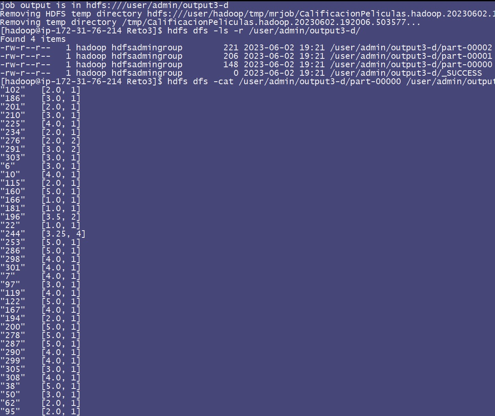  

e) Día en que peor evaluación en promedio han dado los usuarios:
```sh
python PeorCalificacion.py hdfs:///user/admin/datasets/otros/datapeliculas.txt -r hadoop --output-dir hdfs:///user/admin/output3-e
```
Dia de la peor calificacion:    2014-03-20  
Calificacion promedio:          2.63
  
Para visualizar la data use estos comandos:
```sh
hdfs dfs -ls -r /user/admin/output3-e/
hdfs dfs -cat /user/admin/output3-e/part-00000 /user/admin/output3-e/part-00001 /user/admin/output3-e/part-00002
```
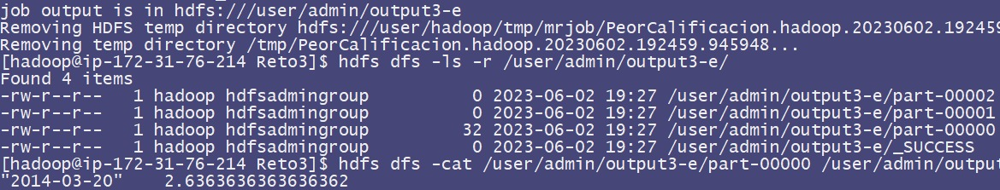  


f) Día en que mejor evaluación han dado los usuarios:
```sh
python MejorCalificacion.py hdfs:///user/admin/datasets/otros/datapeliculas.txt -r hadoop --output-dir hdfs:///user/admin/output3-f
```
Dia de la mejor calificacion:   2014-03-21  
Calificacion promedio:          3.8
  
Para visualizar la data use estos comandos:
```sh
hdfs dfs -ls -r /user/admin/output3-f/
hdfs dfs -cat /user/admin/output3-f/part-00000 /user/admin/output3-f/part-00001 /user/admin/output3-f/part-00002
```
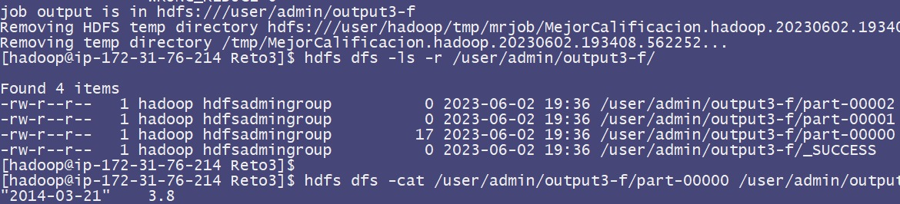 


g) La mejor y peor película evaluada por genero:
```sh
python TopGenero.py hdfs:///user/admin/datasets/otros/datapeliculas.txt -r hadoop --output-dir hdfs:///user/admin/output3-g
```
|   Género   |  ID peor pelicula  |  ID mejor pelicula  |
|------------|-------|-------|
| suspenso   |  377  |  304  |
| accion     | 1081  |  95   |
| religion   |  86   |  98   |
| deportes   |  274  |  274  |
  
Para visualizar la data use estos comandos:
```sh
hdfs dfs -ls -r /user/admin/output3-g/
hdfs dfs -cat /user/admin/output3-g/part-00000 /user/admin/output3-g/part-00001 /user/admin/output3-g/part-00002
```
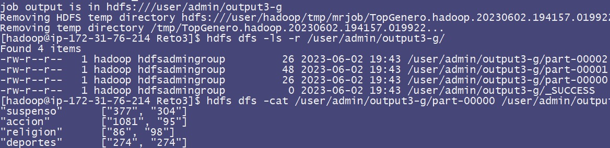 