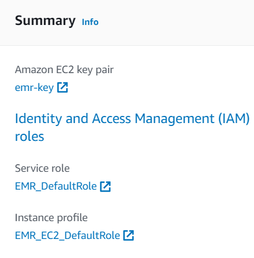

# Reto de programación N1

**Curso:** Tópicos Especiales en Telemática <br>
**Título:** Comunicación entre Procesos Remotos: gRPC.

---

## Tabla de Contenido

1. [Introducción](#introduction)
2. [Problemas](#problemas)
3. [Recursos](#resources)
4. [Desarrollo](#development) 
5. [Despliegue](#deployment) <br>

---

## 1. Introducción

En este reto de laboratorio aprendí a crear clusters en AWS y los puse en práctica.

---

## 2. Problemas

Tuve que cambiar un poco el código de 'wordcount-local.py' y documentarme bien acerca de los comandos para poder editarlos con los respectivos permisos.

---

## 3. Recursos

Utilicé los conocimientos dados en el Laboratorio 5 y comandos tomados y adaptados de:
- [Repositorio del Laboratorio N6-MapReduce](https://github.com/ST0263/st0263-2023-1/tree/main/Laboratorio%20N6-MapReduce)
- [Guía de instalación de AWS CLI](https://docs.aws.amazon.com/cli/latest/userguide/getting-started-install.html)
- [Cómo crear y ejecutar un clúster EMR utilizando AWS CLI](https://towardsdatascience.com/how-to-create-and-run-an-emr-cluster-using-aws-cli-3a78977dc7f0#6df6)
- [Hadoop: Cómo listar archivos y directorios usando HDFS dfs](https://sparkbyexamples.com/apache-hadoop/hadoop-how-to-list-files-and-directories-using-hdfs-dfs/)

---

## 4. Desarrollo

Estos pasos solo los tuve que realizar una vez:  

Creación del S3:


Edición del security group de la Node Primaria/Master para que reciba SSH de todos lados:


Para instalar el AWS CLI, usa el siguiente comando:
'''sh
msiexec.exe /i https://awscli.amazonaws.com/AWSCLIV2.msi
'''
Tomado de [Guía de instalación de AWS CLI](https://docs.aws.amazon.com/cli/latest/userguide/getting-started-install.html)


Se necesita crear una carpeta en el directorio root del usuario llamada '.aws' y dentro de ella se crean 2 archivos sin extensión llamados 'credentials' y 'config':


'''plaintext
[default]
aws_access_key_id=
aws_secret_access_key=
aws_session_token=
'''

---

## 5. Laboratorio 5

Crea el cluster usando la interfaz gráfica de AWS:




Instalación de requerimientos:
'''sh
sudo yum install python3-pip &&
sudo pip3 install mrjob &&
sudo yum install git -y
'''

Clonar el repositorio:
'''sh
git clone https://github.com/pmayavi/LabReto6_TET_PabloMayaV.git
cd LabReto6_TET_PabloMayaV/wordcount
'''

Prueba del código:
'''sh
python wordcount-mr.py /home/hadoop/LabReto6_TET_PabloMayaV/datasets/gutenberg-small/*.txt
'''


---


*******
<div id='awscli'/>  

### **6. Creacion cluster por AWS CLI**

Se crea la cluster desde la consola con las especificaciones dadas usando AWS CLI:
```sh
aws emr create-cluster --release-label emr-6.10.0 --instance-type m4.large --instance-count 3 --log-uri s3://pmayav-lab-emr/logs --use-default-roles --ec2-attributes KeyName=emr-key,SubnetId=subnet-01fd4a313d0de3645 --no-termination-protected
```

Luego de que se cree correctamente el cluster se toma el nombre DNS de la Node Primaria/Master

y se establece la conexion:
```sh
ssh -i emr-key.pem hadoop@ec2-44-192-253-171.compute-1.amazonaws.com
```

*******
<div id='mainnode'/>  

### **7. Funcionalidad de la Main Node**

Instalacion de requerimientos:
```sh
sudo yum install python3-pip &&/
sudo pip3 install mrjob &&/
sudo yum install git -y
```

Clonar el repositorio:
```sh
git clone https://github.com/pmayavi/LabReto6_TET_PabloMayaV.git
cd LabReto6_TET_PabloMayaV/wordcount
```

Creacion de usuario admin de Hadoof y copiar los datasets al usuario:
```sh
hdfs dfs -mkdir /user/admin/
hdfs dfs -copyFromLocal /home/hadoop/LabReto6_TET_PabloMayaV/datasets/ /user/admin/
```

Ejecutamos el wordcount-mr.py en los datasets de Hadoof, el output resultara en la carpeta 'output1'
```sh
python wordcount-mr.py hdfs:///user/admin/datasets/gutenberg-small/*.txt -r hadoop --output-dir hdfs:///user/admin/output1
```
Podemos ver las partes del output usando el comando:
```sh
hdfs dfs -ls -r /user/admin/output1/
```
Y con el comando para ver cada parte por su cuenta:
```sh
hdfs dfs -cat /user/admin/output1/part-00000
```

*******
<div id='reto1'/>  

### **8. Reto de programacion 1**

*******
